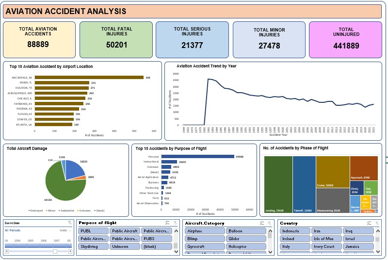

# aviation-accident-analysis-excel-dashboard
Excel-based analytics dashboard analyzing aviation accident trends, flight-phase risks, geographic patterns, injury severity, and aircraft damage to support data-driven aviation safety insights.
# ✈️ Aviation Accident Analytics Dashboard (Excel)

## 📊 Dashboard Preview

## Project Overview
This project is an **end-to-end aviation accident analysis dashboard built entirely in Microsoft Excel**.  
It transforms raw aviation accident data into a structured, interactive dashboard that highlights **patterns, risk areas, and safety insights** across time, geography, and operational dimensions.

The focus is not decoration. It is **analysis, interpretation, and decision support** using Excel as a full analytics tool.

---

## Business Context
Aviation safety analysis depends on understanding:
- When accidents occur
- Where they are concentrated
- Why they happen
- At which phase of flight risks peak
- The severity of outcomes (fatal, serious, minor injuries, aircraft damage)

Raw datasets make these patterns hard to see.  
This dashboard converts historical accident data into **actionable intelligence** that can support:
- Safety audits
- Policy reviews
- Risk mitigation planning
- Training and operational improvements

---

## Dataset Structure
The Excel file contains multiple analytical sheets feeding a central dashboard:

- **Data** – Raw accident-level dataset
- **Accident by Year** – Temporal trend analysis
- **Location-wise Accident** – Geographic distribution
- **Accidents by Purpose of Flight** – Operational intent analysis
- **Phase of Flight** – Risk by flight stage
- **Total Aircraft Damage** – Severity classification
- **KPI** – High-level safety metrics
- **Dashboard** – Final interactive visualization layer

---

## Key KPIs Tracked
- Total number of recorded aviation accidents
- Total fatal injuries
- Total serious injuries
- Total minor injuries
- Aircraft damage severity distribution

These KPIs provide an instant snapshot of **overall aviation safety outcomes**.

---

## Core Analysis & Insights

### 1. Accident Trends Over Time
- Year-wise analysis reveals long-term trends and spikes.
- Helps identify whether safety outcomes are improving or deteriorating.
- Useful for correlating policy or regulatory changes with outcomes.

### 2. Location-wise Accident Distribution
- Certain regions show higher accident concentrations.
- Highlights geography-specific risks such as terrain, weather, or traffic density.
- Supports region-focused safety interventions.

### 3. Purpose of Flight Analysis
- Accidents vary significantly by purpose (commercial, private, training, etc.).
- Training and non-commercial flights often show different risk profiles.
- Helps tailor safety protocols by operation type.

### 4. Phase of Flight Risk Assessment
- Accidents are not evenly distributed across flight phases.
- Takeoff, landing, and approach phases typically show higher risk.
- Critical for pilot training and procedural reinforcement.

### 5. Aircraft Damage Severity
- Categorizes accidents by level of aircraft damage.
- Links severity with operational and phase-based patterns.
- Useful for insurance, maintenance, and regulatory analysis.

---

## Dashboard Design Approach
- Pivot tables for structured aggregation
- Pivot charts for visual storytelling
- Slicers for interactive filtering
- Clean KPI cards for executive-level consumption
- Single-page dashboard for fast comprehension

Everything updates dynamically within Excel without external tools.

---

## Tools & Techniques Used
- Microsoft Excel
- Pivot Tables & Pivot Charts
- Slicers & Filters
- KPI Cards
- Data Cleaning & Structuring
- Analytical Reasoning & Insight Generation

No Power BI. No external plugins. Pure Excel.

---

## Why This Project Matters
This project demonstrates:
- Strong analytical thinking using Excel
- Ability to design insight-driven dashboards
- Understanding of aviation safety metrics
- Skill in converting raw data into decisions

It reflects **real-world analytics work**, especially relevant for:
- Data Analyst roles
- Safety & compliance analytics
- Government and policy consulting
- Monitoring & evaluation functions

---

## Future Enhancements
- Trend forecasting using historical patterns
- Severity-weighted risk scoring
- Region-wise normalization (accidents per traffic volume)
- Automated data refresh pipeline

---

## Author
Created by **Waseem Ahmad Dar**  
Focused on data clarity, analytical depth, and practical insight — not cosmetic visuals.
